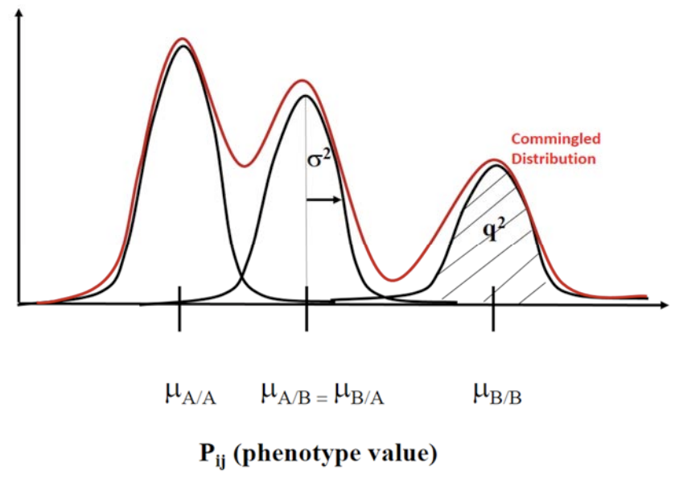

# Projects 1 & 2: Commingling Analysis 

## Write a Program to do ML COMMINGLING ANLYSIS on the linkdata.sas QUANTITATIVE simulated data 

Commingling analysis is the part of ML linkage analysis that deals with unrelated founders in pedigrees (in this case, the parents in the nuclear families). You can think of commingling analysis as a kind of cluster analysis,
in which there are (up to) 3 clusters driven by the 3 genotypes of an untyped (unmeasured) SNP. Assume that the quantitative phenotype is NORMALLY DISTRIBUTED within each of the 3 unknown disease genotype groups (sometimes called the “major gene.”) You may assume the parents are statistically independent (unrelated). Your program must calculate and output the maximum likelihood estimator of 5 parameters: 

- &mu;aa,  &mu;ab, &mu;bb: 3 disease genotypic means of the quantitative phenotype 
- &sigma;2: common variance of the quantitative phenotype within each of the 3 disease genotype groups 
- q: allele frequency of (one of) the disease gene alleles 

This project uses as input data ONLY the QUANTIATIVE PHENOTYPE (QTp) on the PARENTS ONLY (ignore the children’s data). It CANNOT use the disease genotypes (which are unknown, even though they were used to generate the data). The marker genotypes are irrelevant to Project 1 (why?). You need to test your program with different datasets each generated by the same linkdata.sas but with different values of the basic generating parameters. How would you generate a “null dataset” (no major gene, just one normal distribution). How would you generate a dominant (recessive) model for the major gene? 
